# Test automation project for UI [MasterChain](https://www.dltru.org/)

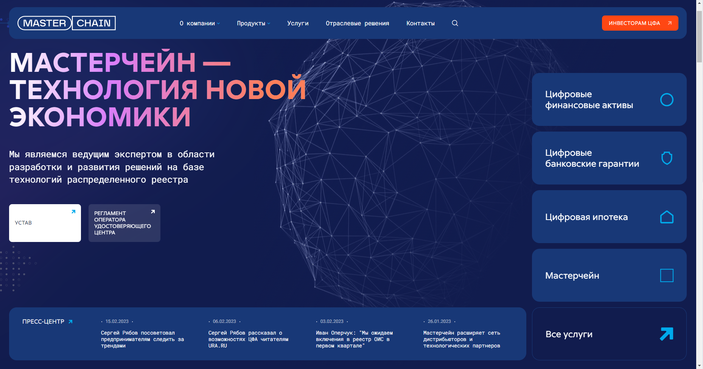

> MasterChain is a leading expert in the development of solutions based on distributed registery technologies
> 
# <a name="Contents">Contents</a>
+ [Description](#Description)
+ [Tools and technologies](#Technology)
+ [How to run](#Jenkins)
    + [Gradle command](#GradleCommand)
    + [Run in Jenkins](#RunInJenkins)
+ [Telegram Notifications](#TelegramNotifications)
+ [Test results report in Allure Report](#AllureReport)
+ [Allure TestOps integration](#AllureTestOps)
    + [Project in Allure TestOps](#AllureTestOpsProject)
    + [Dashboards](#Dashboards)
+ [Jira integration](#Jira)
+ [Video of running tests](#Video)


# <a name="Description">Description</a>
The test project consists of Web tests.\
A brief list of interesting facts about the project:

- [x] Parametrized tests
- [x] Parametrized build
- [x] Different configuration files for test running depending on build parameters
- [x] `Allure TestOps` integration
- [x] Autotests as test documentation
- [x] `Jira` integration
- [x] Parallel execution


# <a name="Technology">Tools and technologies</a>
<p  align="center">
  <code></code>
  <code></code>
  <code></code>
  <code></code>
  <code></code>
  <code></code>
  <code></code>
  <code></code>
  <code></code>
  <code></code>
  <code></code>
  <code></code>
</p>


The autotests in this project are written in `Java` using `Selenide` framework.\
`Gradle` - is used as a build automation tool.  \
`JUnit5` - to execute tests.\
`Jenkins` - CI/CD for running tests remotely.\
`Selenoid` - to remote launching browsers in `Docker` containers.\
`Allure Report` - for test results visualisation.\
`Telegram Bot` - for test results notifications.\
`Allure TestOps` - as Test Management System.

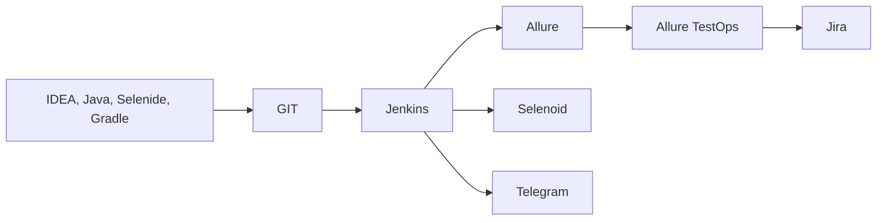

[Back to the Contents ⬆](#Contents)

# <a name="HowToRun">How to run</a>

## <a name="GradleCommand">Gradle command</a>
To run locally and in Jenkins the following command is used:
```bash
gradle clean test
```
Additional parameters:
>+ `-Dbrowser=${BROWSER}`- browser choice
>+ `-Dbrowser_vertion=${BROWSER_VERSION}`- browser version choice
>+ `-DmenuItem=${MENU_ITEM}`- tested menu item choice


`TASK` - tests with this tag will be executed:
>- *test*
>- *simple_test*
>- *menu_test*

[Back to the Contents ⬆](#Contents)


## <a name="RunInJenkins">Run in [Jenkins]https://jenkins.autotests.cloud/job/Master_chain_site/)</a>
Main page of the build:
<p  align="center">
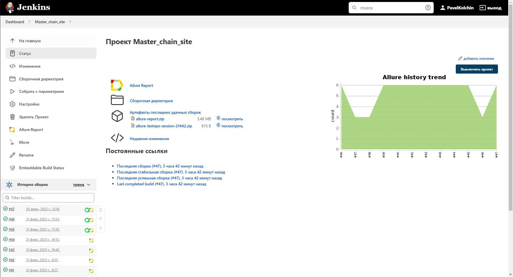
</p>

A parametrized Jenkins job can be launched with needed ***BROWSER***, ***BRAWSER VERTION***, ***TASK*** and ***MENU ITEM***:
<p  align="center">
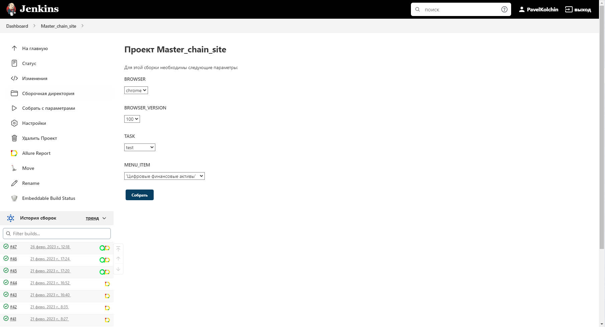
</p>

`project-{runIn}.properties` config files are created in the build workspace on start build.


After the build is done the test results are available in:
>- <code><strong>*Allure Report*</strong></code>
>- <code><strong>*Allure TestOps*</strong></code> - results are uploaded there and the automated test-cases can be automatically updated accordingly to the recent changes in the code.

<p  align="center">
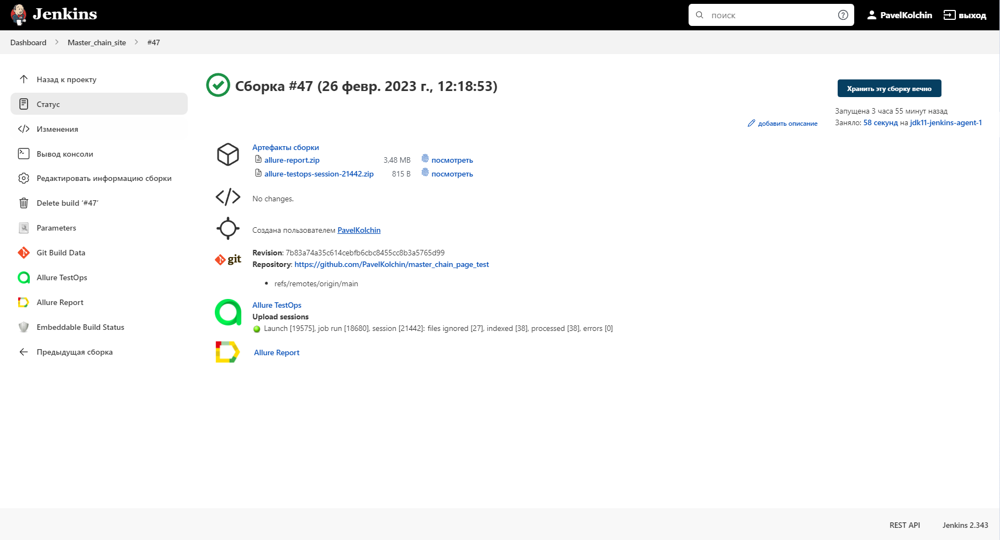
</p>

[Back to the Contents ⬆](#Contents)


# <a name="TelegramNotifications">Telegram Notifications</a>
Telegram bot sends a brief report to a specified telegram chat by results of each build.
<p  align="center">
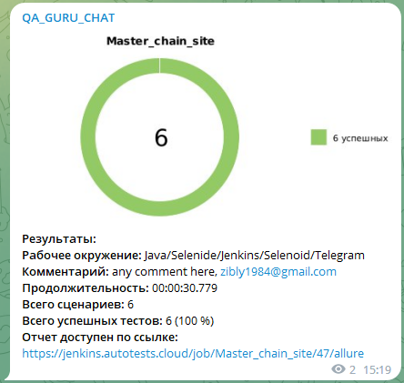
</p>

[Back to the Contents ⬆](#Contents)

# <a name="AllureReport">Test results report in [Allure Report](https://jenkins.autotests.cloud/job/C12-vyach_son-bookmate_test/47/allure/)</a>

## Main page
Main page of Allure report contains the following blocks:

>- <code><strong>*ALLURE REPORT*</strong></code> - displays date and time of the test, overall number of launched tests, а также диаграмму с указанием процента и количества успешных, упавших и сломавшихся в процессе выполнения тестов
>- <code><strong>*TREND*</strong></code> - displays trend of running tests for all runs
>- <code><strong>*SUITES*</strong></code> - displays distribution of tests by suites
>- <code><strong>*CATEGORIES*</strong></code> - displays distribution of unsuccessful tests by defect types
<p align="center">
  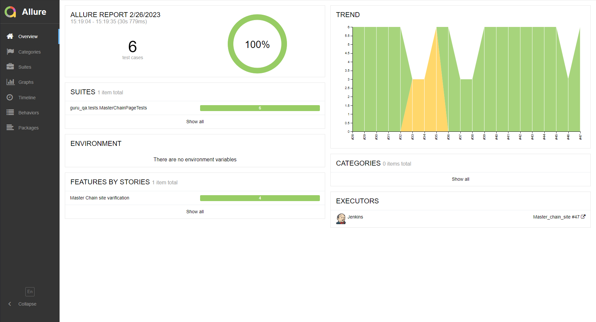
</p>

## List of tests with steps and test artefacts
On the page the list of the tests grouped by suites with status shown for each test.\
Full info about each test can be shown: tags, severity, duration, detailed steps.\

<p align="center">
  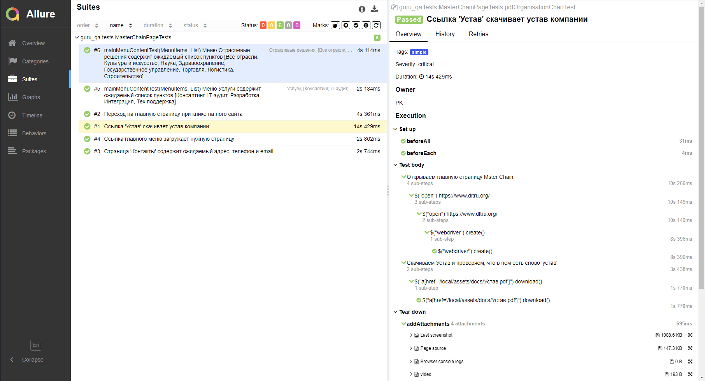
</p>

Also additional test artifacts are available:
>- Screenshot
>- Page Source
>- Video
>- Browserstack full info link


[Back to the Contents ⬆](#Contents)

# <a name="AllureTestOps">[Allure TestOps](https://allure.autotests.cloud/project/1909/test-cases/15117?treeId=3669) integration</a>
> The link can be accessed only by authorized users.

## <a name="AllureTestOpsProject">Project in Allure TestOps</a>
Test-cases in the project are imported and constantly updated from the code,
so there is no need in complex process of synchronization manual test-cases and autotests.\
It is enough to create and update an autotest in the code and the test-case in TMS always will be in actual state.\
Manual test-cases also can be added in TMS in case of need(via web interface or via code).
<p align="center">
  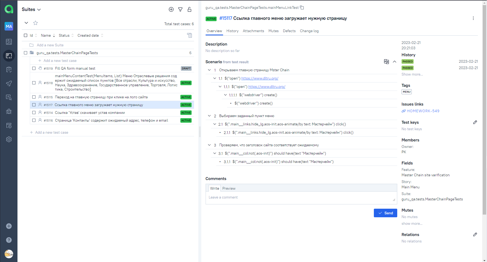
</p>

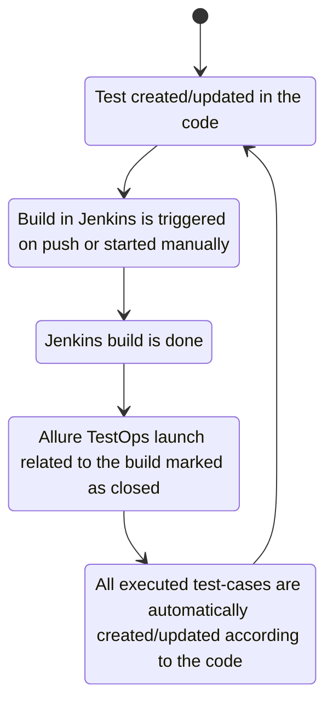

## <a name="AllureTestOpsStartTests">Ability to start a run of custom set of tests from Allure TestOps</a>
Any person not related to autotest creation can select a set of tests, environment parameter(RunIn) and start a run.\
Allure TestOps run will be created, Jenkins job triggered with correct parameters. And results of the job will be seamlessly integrated into Allure TestOps.

As soon as the Jenkins job is done, corresponding tests get their statuses. A tester can finish manual tests(if any) and click "Close launch".

<p align="center">
  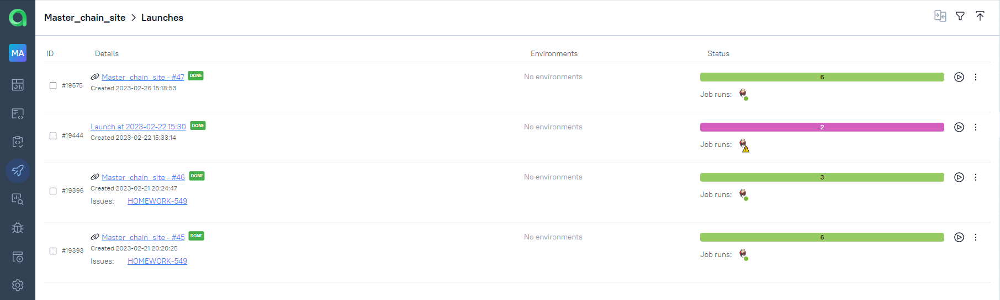
</p>

> After that all these test-cases(names, steps, tags etc.) will be updated according to the recent code changes.

[Back to the Contents ⬆](#Contents)

## <a name="Dashboards">Dashboards</a>
Automation trends charts, distribution tests by some different parameters etc.:
<p align="center">
  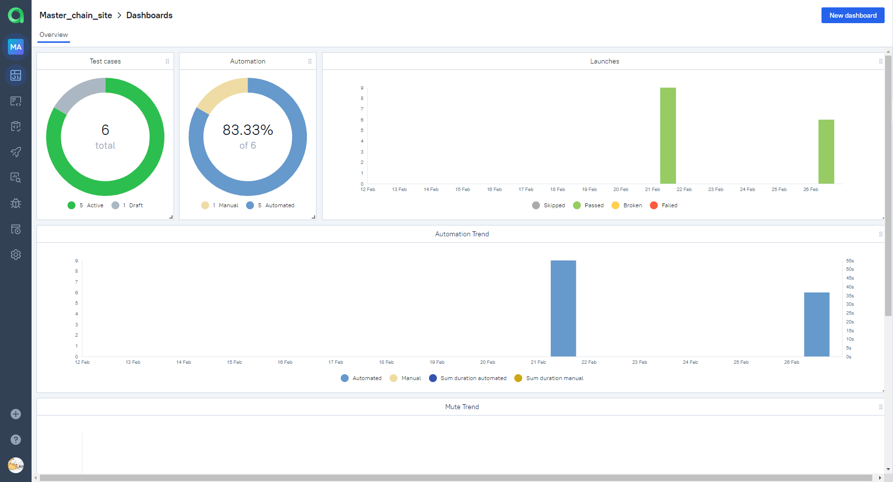
</p>


[Back to the Contents ⬆](#Contents)


# <a name="JiraIntegration">Jira integration</a>
<p align="center">
  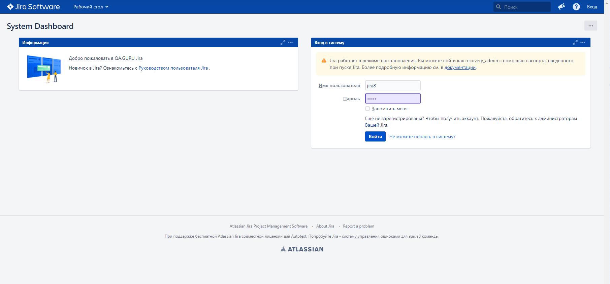
</p>

[Back to the Contents ⬆](#Contents)


# <a name="Video">Video of running tests</a>

<p align="center">
 
</p>


[Back to the Contents ⬆](#Contents)